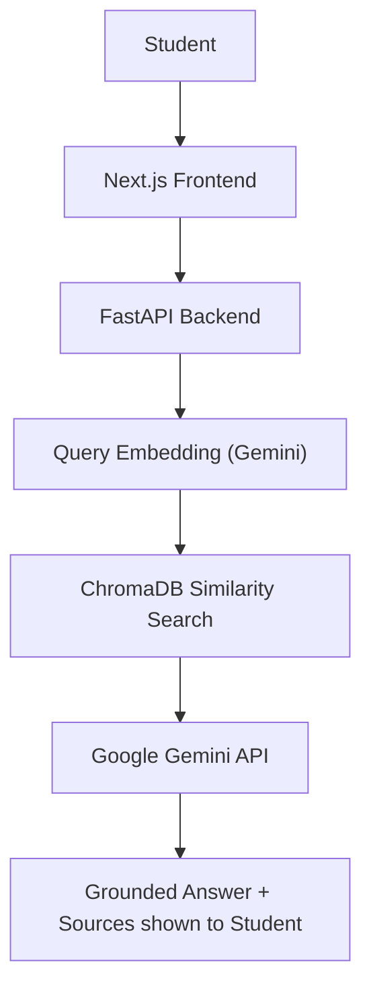
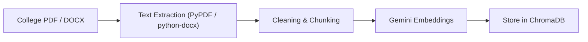
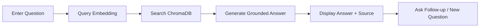
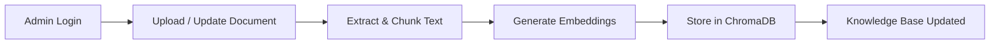

# Software Requirements Specification (SRS)

**Project Title:** AI College FAQ Assistant

**Team Name:** Hash Masters

**Team Lead:** Sanjay Krishna C

**Project Type:** Generative AI Hackathon

---

## Purpose

The purpose of this project is to develop a web-based **AI College FAQ Assistant** that enables students to obtain reliable information about their college through natural-language questions.

The system uses Generative AI and a custom Retrieval-Augmented Generation (RAG) pipeline to retrieve relevant information from authorized college documents before generating an answer. The primary objective is to make college information easier to access while reducing unsupported AI-generated answers through source-grounded responses.

## Problem Statement

Students often need information regarding the following areas:

- Academic regulations
- Attendance requirements
- Examination procedures
- Fee-related information
- Hostel rules
- Scholarships
- Certificates
- Placement information
- Academic calendars
- College notices and circulars
- Department procedures
- Other administrative information

This information may be distributed across multiple PDFs, DOCX files, circulars, notices, and other college documents, so students may have difficulty finding the correct information quickly. Traditional FAQ systems may also depend on exact keywords and may not understand natural-language questions or follow-up questions effectively.

Therefore, a reliable conversational assistant is required that allows students to ask questions naturally and receive answers based on verified college information.

## Proposed Solution

The proposed solution is a web-based **AI College FAQ Assistant** powered by a **custom Retrieval-Augmented Generation (RAG) pipeline**. Students can ask questions in natural language, and the system answers using information retrieved from authorized college documents. When a question is submitted:

1. The question is received by the **FastAPI** backend.
2. The question is converted into an embedding using **Gemini Embeddings**.
3. **ChromaDB** performs vector similarity search.
4. Relevant college document chunks are retrieved.
5. The retrieved information is provided as context to **Google Gemini**.
6. Gemini generates a grounded response based on the retrieved information.
7. Relevant source information is returned along with the answer.
8. The response is displayed through the **Next.js** frontend.

The system should not blindly generate answers when sufficient evidence is unavailable. If the relevant information cannot be found in the available college knowledge base, the assistant clearly informs the user that it cannot reliably answer the question.

RAG is used as a mechanism for **reducing hallucinations and grounding responses in authorized college information**. It does not guarantee that every answer will be free of errors.

## Target Users

- **Students** – To ask academic and administrative questions, obtain information from college documents, ask follow-up questions, and view the sources supporting each answer.
- **Administrators** – To upload college documents, update or replace outdated documents, and maintain the college knowledge base.
- **Faculty / Staff** – To quickly locate college information using the assistant where appropriate.

## Project Scope

The project focuses on developing a web-based conversational AI assistant that allows users to ask college-related questions and receive answers based on authorized college documents. The system is intended to function as an **information assistant**. It will include:

- Natural-language question answering
- RAG-based document retrieval
- PDF / DOCX document processing
- Semantic vector search
- AI-generated grounded responses
- Source references
- Basic conversation context
- Unknown / unsupported query handling
- Administrative document management where applicable

The system will **not**:

- Make official academic decisions.
- Modify student records.
- Process fee payments.
- Submit official applications unless explicitly added later.
- Replace college administrative staff.
- Invent college policies or regulations.

## Functional Requirements

- Users can access the AI FAQ assistant through the web application.
- Users can submit questions in natural language.
- The system processes each query before retrieval.
- Administrators can ingest college documents (PDF and DOCX).
- PDF text is extracted using PyPDF.
- DOCX text is extracted using python-docx.
- Extracted text is cleaned and split into chunks.
- Document chunks and user queries are converted into vectors using Gemini Embeddings.
- Embeddings and source metadata are stored in ChromaDB.
- The system performs vector similarity search to retrieve relevant college information.
- Retrieved chunks are assembled into context for the LLM.
- Grounded answers are generated using the Google Gemini API.
- Source / citation information is displayed with each answer.
- The assistant handles follow-up questions using conversation context.
- Unknown or unsupported questions receive a clear "cannot reliably answer" response.
- The system displays appropriate error messages when something fails.
- Administrators can upload new documents.
- Administrators can update or remove documents where applicable.
- The system protects against unsupported or hallucinated answers by answering only from retrieved information.

## Non-Functional Requirements

- **Usability:** Simple and student-friendly conversational interface.
- **Performance:** Fast retrieval and response generation.
- **Responsiveness:** Works well on desktop, tablet, and mobile devices.
- **Security:** Protects API keys, administrative functions, and user data.
- **Reliability:** Provides answers grounded in retrieved information.
- **Accuracy:** Retrieved information should be relevant to the user's question.
- **Explainability:** Displays source information where available.
- **Scalability:** Allows additional college documents to be added.
- **Maintainability:** RAG, AI, backend, and frontend components are kept modular.

## System Features / Modules

1. **User / Chat Module**
   - User-friendly chat interface.
   - Natural-language questions and AI responses.
   - Conversation context and follow-up questions.
   - Loading and error states.

2. **Document Ingestion Module**
   - PDF processing using PyPDF.
   - DOCX processing using python-docx.
   - Text extraction and cleaning.
   - Text chunking.
   - Metadata handling.

3. **Embedding Module**
   - Gemini Embeddings.
   - Conversion of document chunks into vectors.
   - Conversion of user queries into vectors.

4. **Vector Database / Retrieval Module**
   - ChromaDB vector storage.
   - Vector similarity search.
   - Retrieval of relevant document chunks.
   - Source metadata.

5. **AI Response Generation Module**
   - Google Gemini API integration.
   - Prompt construction using retrieved context.
   - Grounded answer generation.
   - Hallucination mitigation.
   - Source citation.
   - Insufficient-information handling.

6. **Admin / Knowledge Management Module**
   - Admin access where applicable.
   - Upload college documents.
   - Update documents and remove outdated documents.
   - Maintain the knowledge base.

7. **Backend & API Module**
   - FastAPI REST APIs.
   - Frontend–backend communication.
   - RAG and AI integration.
   - Request and response handling.

## Technology Requirements

| Category | Technology | Purpose |
| -------- | ---------- | ------- |
| **Frontend** | **Next.js** | College portal and web application. |
| | **TypeScript** | Type-safe frontend development. |
| | **Tailwind CSS** | Professional and responsive UI styling. |
| **Backend** | **FastAPI** | REST API and backend services. |
| | **Python** | RAG and AI processing. |
| **AI** | **Google Gemini API** | Generate grounded answers. |
| | **Gemini Embeddings** | Convert documents and queries into vectors. |
| **RAG** | **Custom RAG Pipeline** | Retrieve relevant college information before answer generation. |
| | **ChromaDB** | Store and search document embeddings. |
| | **Vector Similarity Search** | Retrieve relevant information. |
| **Document Processing** | **PyPDF** | PDF text extraction. |
| | **python-docx** | DOCX text extraction. |
| **API Communication** | **REST API** | Communication between Next.js and FastAPI. |
| **Configuration** | **Environment Variables** | Store API keys and configuration securely. |
| **Version Control** | **Git** | — |
| | **GitHub** | — |

## System Architecture

### Query Flow

How a student question is answered:

### Document Ingestion Flow

How college documents enter the knowledge base:

## Team Responsibility

The project is developed by a three-person team, with each member focusing on one development area.

| Area | Responsibilities |
| ---- | ---------------- |
| **RAG** | Document processing, chunking, embeddings, ChromaDB, retrieval, metadata, and source information. |
| **AI** | Gemini API, prompt engineering, context-based answer generation, grounding, hallucination mitigation, source citation, evidence / confidence handling, and conversation context. |
| **Full Stack** | Next.js, TypeScript, Tailwind CSS, FastAPI, REST APIs, frontend / backend integration, user interface, and deployment. |

These three components must be integrated into **one complete system**.

## Project Development Workflow

- Problem Identification → SRS Preparation → UI/UX Design
- RAG Development → AI Development → Frontend Development → Backend Development
- RAG–AI Integration → Frontend–Backend Integration
- Testing → Bug Fixing → Deployment → Final Demonstration

## Expected Outcome

The expected outcome is a web-based AI College FAQ Assistant that allows students to ask college-related questions and receive relevant, source-grounded responses. The system should:

- Retrieve information from authorized college documents.
- Generate natural-language answers using Google Gemini.
- Reduce hallucinations through RAG-based grounding.
- Display relevant sources.
- Handle unsupported questions safely.
- Provide a simple and responsive user interface.
- Allow the knowledge base to be updated with new college documents.

The final system should provide a convenient alternative to manually searching through multiple college documents.

## User & Admin Workflow

### Student Workflow

### Admin Workflow

